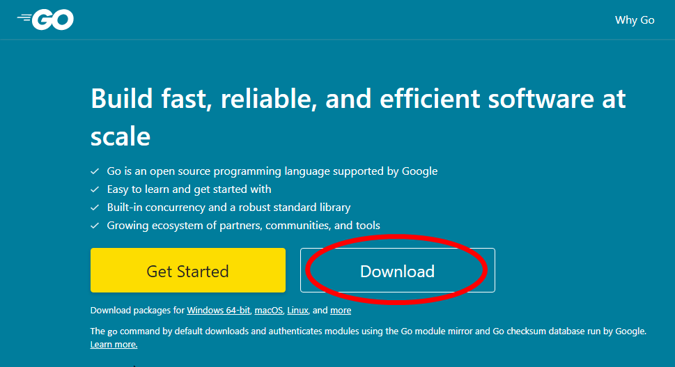

# 第一课 Hello,world!

今天我们来正式学习Ebiten的开发.

## 1. 环境搭建

### 安装 Golang

请参照 [ebiten.org中文翻译](https://github.com/EbitenPot/ebiten.org) 中的安装教程.

首先,安装最新版Golang(<https://golang.google.cn>).



选择最新版本,下载.根据安装程序指示进行安装.

如果您在控制台(CMD或bash等)输入 `go version` 后,命令行输出类似以下的内容,则Golang安装成功.

```sh
$ go version
go version go1.17.5 windows/amd64
```
### 安装Ebiten

然后我们来安装Ebiten.
只需要在控制台输入以下指令:
```sh
go get github.com/hajimehoshi/ebiten/v2
```
> 提示: 如果您在中国大陆地区,您可以使用`goproxy.cn`提供的国内代理加速.
<code><pre>
go env -w GO111MODULE=on
go env -w GOPROXY=https://goproxy.cn,direct
</pre></code>

没有报错,证明Ebiten包获取成功.

### 选择一个开发工具
您可以选择 `Vscode` , `Goland` 等IDE,也可以选择一些文本编辑器.

## 2. 开始写代码

我们知道,